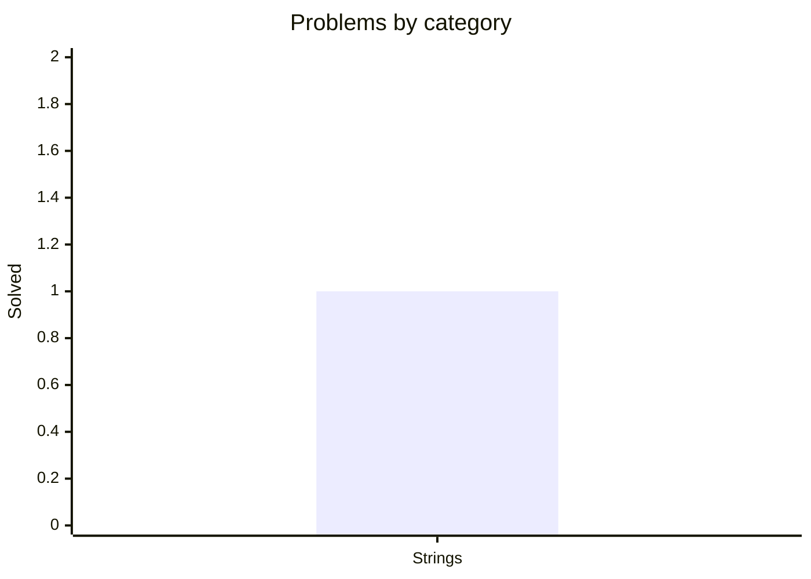

<div align="center">

# 🧩 Data Structures & Algorithms in Kotlin

##### One problem a day — clean, documented, and tested.

[](https://github.com/mauli-waghmore/data-structures-algorithms-kotlin/actions/workflows/ci.yml)
[](https://kotlinlang.org)
[](https://adoptium.net)
[](https://gradle.org)
[](LICENSE)
[](#-progress)

[**📊 Progress**](#-progress) &nbsp;·&nbsp; [**📇 Problems**](#-problem-index) &nbsp;·&nbsp; [**🚀 Run**](#-run--test) &nbsp;·&nbsp; [**➕ Add a problem**](#-adding-a-problem)

</div>

---

## 📊 Progress

<!-- STATS:START -->
<div align="center">

| &nbsp;🧮 Solved&nbsp; | &nbsp;🔥 Current streak&nbsp; | &nbsp;🏆 Longest streak&nbsp; | &nbsp;🗓️ Active (30d)&nbsp; |
|:--:|:--:|:--:|:--:|
| **`1`** | **`0`** days | **`0`** days | **`0`** / 30 |

**🔥 Daily activity** &nbsp;·&nbsp; <sub>2026-05-19 → 2026-06-17</sub>

⬜⬜⬜⬜⬜⬜⬜<br>⬜⬜⬜⬜⬜⬜⬜<br>⬜⬜⬜⬜⬜⬜⬜<br>⬜⬜⬜⬜⬜⬜⬜<br>⬜🔴

<sub>🟩 solved &nbsp;·&nbsp; ⬜ missed &nbsp;·&nbsp; 🔴 today (pending)</sub>

</div>

<b>📚 Problems by category</b>


<!-- STATS:END -->

<div align="center"><sub>Everything above is generated from <code>src/</code> on every push — never edited by hand.</sub></div>

## 📇 Problem index

<!-- INDEX:START -->
| #  | Date | Problem | Category | Technique | Time | Space | Tests |
|----|------|---------|----------|-----------|------|-------|-------|
| 01 | — | [Line Wrap (Word Wrap)](src/strings/greedy/LineWrap.kt) | Strings | Greedy | O(n) | O(n) | [view](test/strings/greedy/LineWrapTest.kt) |
<!-- INDEX:END -->

## 🚀 Run & test

> Requires **JDK 17+**. Gradle ships via the wrapper — no local install needed.

```bash
./gradlew test                                            # run all tests
./gradlew build                                           # compile + test
./gradlew runProblem -Pmain=strings.greedy.LineWrapKt     # run one problem's main()
```

## ➕ Adding a problem

The tracking is automatic — to log a new problem I only:

1. Add **`src/<category>/<technique>/Name.kt`** with the standard KDoc header
   (title on the first line, plus `Time:` and `Space:` lines — see [LineWrap.kt](src/strings/greedy/LineWrap.kt)).
2. Add **`test/<category>/<technique>/NameTest.kt`** with its tests.
3. Push — the streak, graph, index, badge, and version all update themselves.

<details>
<summary><b>🗂️ Project structure</b></summary>

<br>

```
data-structures-algorithms-kotlin/
├── src/<category>/<technique>/*.kt    # solutions  (package mirrors the path)
├── test/<category>/<technique>/*.kt   # tests       (mirror of src/)
├── scripts/generate_readme.py         # rebuilds the progress + index sections
├── .github/workflows/                 # CI (build + test) and progress tracking
├── build.gradle.kts                   # Gradle (Kotlin DSL); version = problem count
└── settings.gradle.kts
```

</details>

## 📜 License

MIT — see [LICENSE](LICENSE).

---

<div align="center">
<sub>⭐ Star the repo if it helps you · Built with Kotlin · One problem a day.</sub>
</div>
