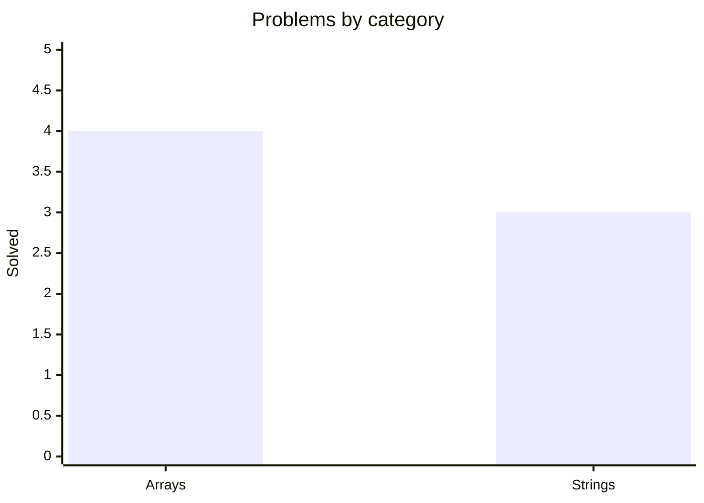

<div align="center">

# 🧩 Data Structures & Algorithms in Kotlin

##### One problem a day — clean, documented, and tested.

[](https://github.com/mauli-waghmore/data-structures-algorithms-kotlin/actions/workflows/ci.yml)
[](https://kotlinlang.org)
[](https://adoptium.net)
[](https://gradle.org)
[](LICENSE)
[](#-progress)

[**📊 Progress**](#-progress) &nbsp;·&nbsp; [**📇 Problems**](#-problem-index) &nbsp;·&nbsp; [**🚀 Run**](#-run--test) &nbsp;·&nbsp; [**➕ Add a problem**](#-adding-a-problem)

</div>

---

## 📊 Progress

<!-- STATS:START -->
<div align="center">

🧮 **7** solved &nbsp;·&nbsp; 🔥 **7**-day streak &nbsp;·&nbsp; 🏆 **7** longest &nbsp;·&nbsp; 🗓️ **7** / 30 active

🔥 **Daily activity** &nbsp;·&nbsp; 2026-05-25 → 2026-06-23


</div>

<b>📚 Problems by category</b>


<!-- STATS:END -->

<div align="center"><sub>Everything above is generated from <code>src/</code> on every push — never edited by hand.</sub></div>

## 📇 Problem index

<!-- INDEX:START -->
| # | Problem | Topic | Time | Space | Test | Added |
|:---:|:--|:--|:---:|:---:|:---:|:---:|
| 01 | [Line Wrap (Word Wrap)](src/strings/greedy/LineWrap.kt) | `Strings` · `Greedy` | `O(n)` | `O(n)` | [🧪](test/strings/greedy/LineWrapTest.kt) | 2026-06-17 |
| 02 | [Fruit Into Baskets](src/arrays/slidingwindow/FruitIntoBaskets.kt) | `Arrays` · `Sliding Window` | `O(n)` | `O(1)` | [🧪](test/arrays/slidingwindow/FruitIntoBasketsTest.kt) | 2026-06-18 |
| 03 | [Longest Repeating Character Replacement](src/strings/slidingwindow/LongestRepeatingCharacterReplacement.kt) | `Strings` · `Sliding Window` | `O(n)` | `O(1)` | [🧪](test/strings/slidingwindow/LongestRepeatingCharacterReplacementTest.kt) | 2026-06-19 |
| 04 | [Binary Subarray With Sum](src/arrays/slidingwindow/BinarySubarrayWithSum.kt) | `Arrays` · `Sliding Window` | `O(n)` | `O(1)` | [🧪](test/arrays/slidingwindow/BinarySubarrayWithSumTest.kt) | 2026-06-20 |
| 05 | [Count Number of Nice Subarrays](src/arrays/slidingwindow/CountNumberOfNiceSubarrays.kt) | `Arrays` · `Sliding Window` | `O(n)` | `O(1)` | [🧪](test/arrays/slidingwindow/CountNumberOfNiceSubarraysTest.kt) | 2026-06-21 |
| 06 | [Number of Substrings Containing All Three Characters](src/strings/slidingwindow/NumberOfSubstringsContainingAllThreeCharacters.kt) | `Strings` · `Sliding Window` | `O(n)` | `O(1)` | [🧪](test/strings/slidingwindow/NumberOfSubstringsContainingAllThreeCharactersTest.kt) | 2026-06-22 |
| 07 | [Maximum Points You Can Obtain from Cards](src/arrays/slidingwindow/MaximumPointsYouCanObtainFromCards.kt) | `Arrays` · `Sliding Window` | `O(k)` | `O(1)` | [🧪](test/arrays/slidingwindow/MaximumPointsYouCanObtainFromCardsTest.kt) | 2026-06-23 |
<!-- INDEX:END -->

## 🚀 Run & test

> Requires **JDK 17+**. Gradle ships via the wrapper — no local install needed.

```bash
./gradlew test                                            # run all tests
./gradlew build                                           # compile + test
python3 scripts/generate_readme.py --check                # verify generated README sections
./gradlew runProblem -Pmain=strings.greedy.LineWrapKt     # run one problem's main()
./gradlew reviewRandom                                    # pick a past problem to revisit 🎯
```

## ➕ Adding a problem

One command scaffolds **both** files (solution + test) from the template — no boilerplate:

```bash
./gradlew newProblem -Pid=arrays.two_pointers.TwoSum
```

That creates `src/arrays/two_pointers/TwoSum.kt` (with the KDoc header — fill in the
problem, `Time:` and `Space:`) and `test/arrays/two_pointers/TwoSumTest.kt`. Then solve it,
run `./gradlew build` and `python3 scripts/generate_readme.py --check`, and **push** — the
streak, graph, index, badge, and version all update themselves.

<details>
<summary><b>🗂️ Project structure</b></summary>

<br>

```
data-structures-algorithms-kotlin/
├── src/<category>/<technique>/*.kt    # solutions  (package mirrors the path)
├── test/<category>/<technique>/*.kt   # tests       (mirror of src/)
├── scripts/generate_readme.py         # rebuilds the progress + index sections
├── assets/activity.svg                # generated 30-day activity calendar
├── .github/workflows/                 # CI (build + test) and progress tracking
├── build.gradle.kts                   # Gradle (Kotlin DSL); version = problem count
└── settings.gradle.kts
```

</details>

## 📜 License

MIT — see [LICENSE](LICENSE).

---

<div align="center">
<sub>⭐ Star the repo if it helps you · Built with Kotlin · One problem a day.</sub>
</div>
