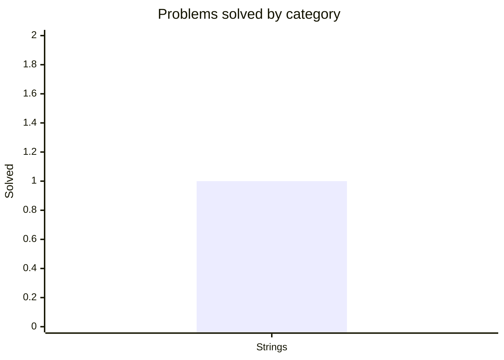

<div align="center">

# 🧩 Data Structures & Algorithms in Kotlin

**One problem a day — solved cleanly, documented clearly, and covered by tests.**

[](https://github.com/mauli-waghmore/data-structures-algorithms-kotlin/actions/workflows/ci.yml)
[](https://kotlinlang.org)
[](https://adoptium.net)
[](https://gradle.org)
[](LICENSE)
[](#-progress)

</div>

---

## ✨ About

My personal, **test-driven** log of data-structure and algorithm problems, solved in idiomatic
Kotlin — **one problem every day**. I keep each solution clean and documented so the repo doubles
as a study journal. It's public, so feel free to browse and learn from it.

Every solution is:

- 📦 **Self-contained** — one problem per file, organized by `category/technique`.
- 📝 **Documented** — a header states the problem, approach, and time/space complexity.
- ✅ **Tested** — each solution ships with `kotlin.test` cases, verified in CI on every push.
- 🏃 **Runnable** — every file has a `main()` demo you can run individually.

## 📊 Progress

<!-- STATS:START -->
**Problems solved:** 1  ·  **Last updated:** 2026-06-16


<!-- STATS:END -->

> The progress graph and the problem index below are **generated automatically** from the files in
> `src/` on every push by the [Update Progress](.github/workflows/update-stats.yml) workflow — I
> never edit them by hand.

## 🗂️ Repository structure

```
data-structures-algorithms-kotlin/
├── src/                              # solutions (one problem per file)
│   └── strings/
│       └── greedy/
│           └── LineWrap.kt           #   package strings.greedy
├── test/                             # tests, mirroring the src/ layout
│   └── strings/
│       └── greedy/
│           └── LineWrapTest.kt
├── scripts/generate_readme.py        # rebuilds the progress graph + problem index
├── build.gradle.kts                  # Gradle (Kotlin DSL) build
├── settings.gradle.kts
└── .github/workflows/                # build + test, and progress tracking
```

Folders are named `category/technique`, and the Kotlin package always mirrors the path
(e.g. `src/strings/greedy/` → `package strings.greedy`).

## 🚀 Getting started

> Requires **JDK 17+**. Gradle is provided via the wrapper — no local install needed.

```bash
./gradlew test                                            # run the full test suite
./gradlew build                                           # compile + test everything
./gradlew runProblem -Pmain=strings.greedy.LineWrapKt     # run a single problem's main()
```

## ➕ Adding a problem

The tracking is fully automated — to log a new problem I only:

1. Add the solution at `src/<category>/<technique>/Name.kt` with the standard KDoc header
   (title on the first line, plus `Time:` and `Space:` lines — see [LineWrap.kt](src/strings/greedy/LineWrap.kt)).
2. Add its test at `test/<category>/<technique>/NameTest.kt`.
3. Push. The graph, the counters, and the problem index update themselves.

## 📇 Problem index

<!-- INDEX:START -->
| #  | Date | Problem | Category | Technique | Time | Space | Tests |
|----|------|---------|----------|-----------|------|-------|-------|
| 01 | — | [Line Wrap (Word Wrap)](src/strings/greedy/LineWrap.kt) | Strings | Greedy | O(n) | O(n) | [view](test/strings/greedy/LineWrapTest.kt) |
<!-- INDEX:END -->

## 📜 License

Released under the [MIT License](LICENSE).
